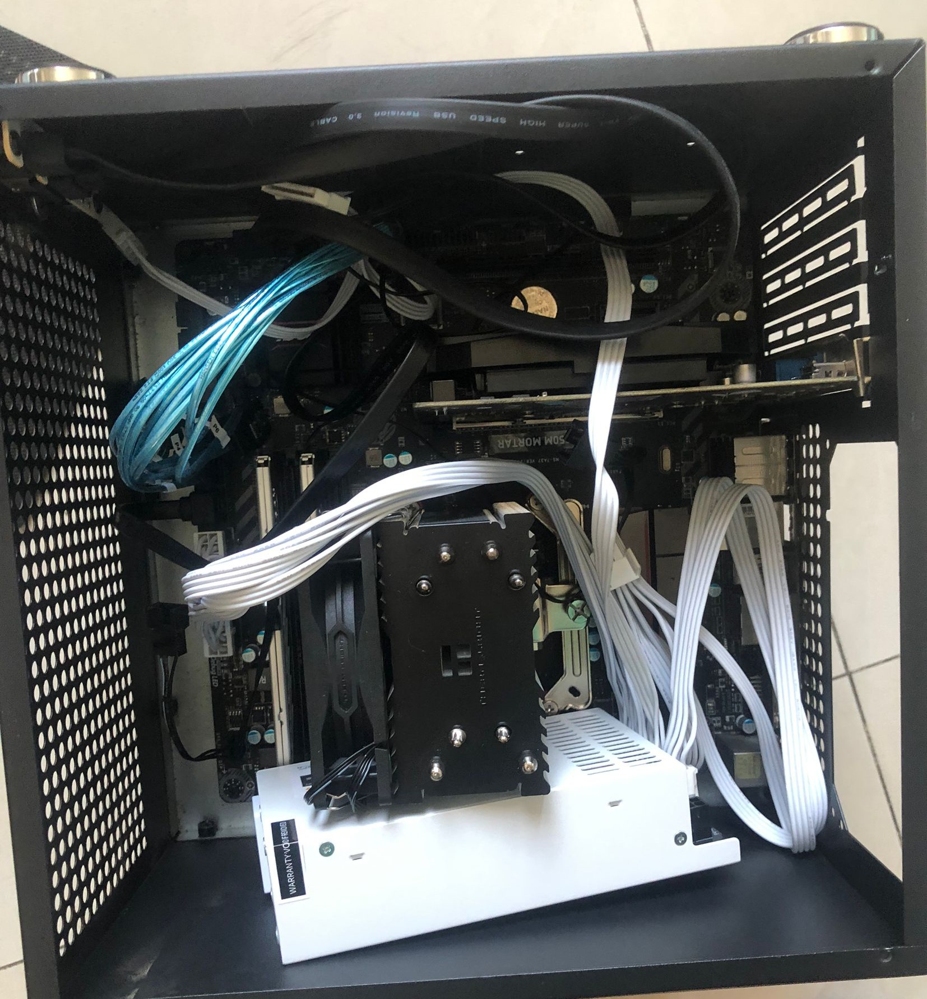
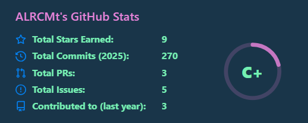
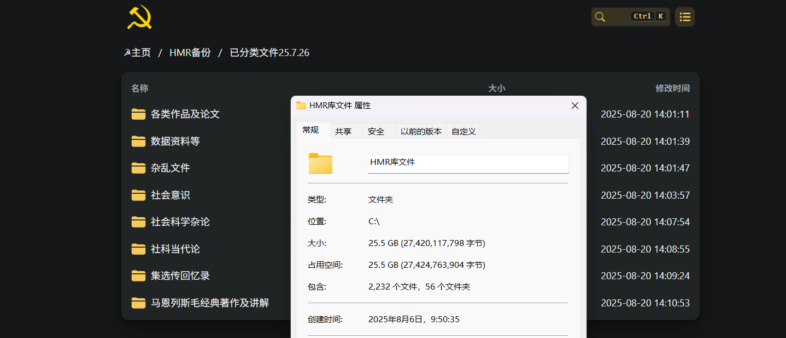
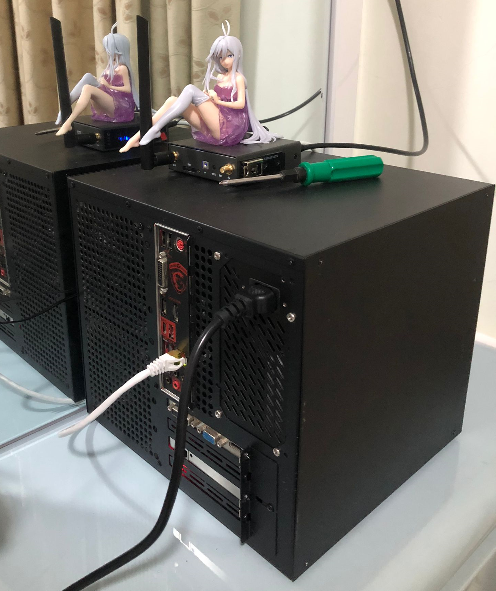
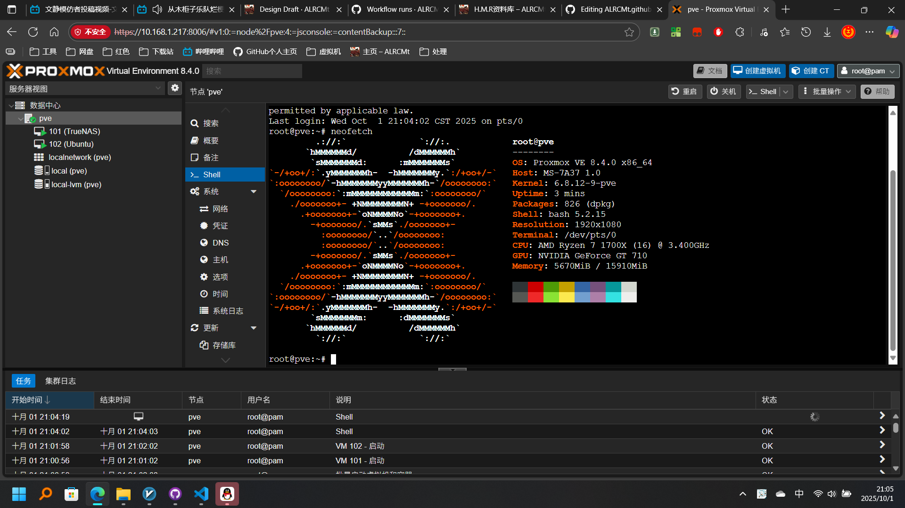

<b>ALRCMt 的个人网站！:)</b>

<table width="400">
<tr>
<th colspan=2>疯狂星期四，v我50</th>
</tr>
<tr>
<th></th>
<th>我，Mt 打钱 懂？</th>
</tr>
</table>

鉴证大舞台有种你就来，没种我也来，只不过我只站着看而已  
沉默看书，QQ、B站、知乎、TG、X通通不辩经（哎哲逼怎么这么坏）  
理科生理论水平低低低低（我看文科生也没好到哪里去）  

装机入门水平，玩玩NAS、软路由，平时折腾折腾Liunx、PVE  
不曾熟练掌握任何计算机语言，极不熟练使用JavaScript  
ctrl+c太好用了你知道吗 （哎\u{200b}怎么这么坏）

> <b>重大新闻：<i>不是小男娘 不是小男娘 不是小男娘</i></b>

<i>装机线是不理的</i>  

<i>代码是懒得写的（截止2025.9）</i>  

<i>塔学造诣是没有的</i>  

### 成就

- H.M.R.资料库的建立（旧）
- MtENP个人服务器的搭建

前者没有什么技术含量（实则不然），断断续续整理了两千多件社会科学资料，目前该项目正处于重开发状态  
后者纯折腾折腾，看我教程应该都看得明白（是吧？），相信就连你也可以学会  

- HMR(显然服务没有开)

- 服务器外观（手办是蕾娜，随便买的便宜货）  

- 服务器web  

 

